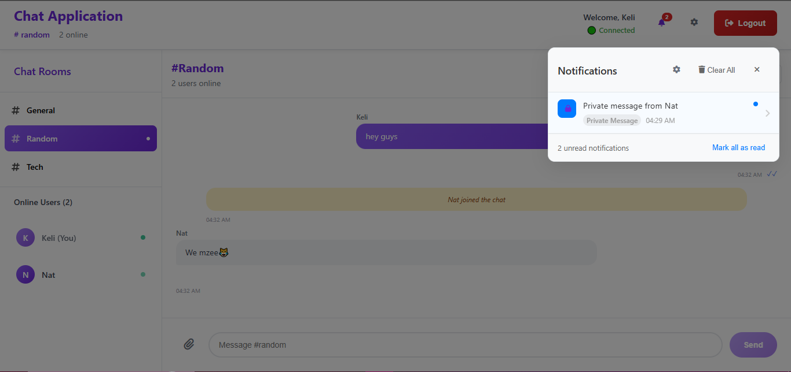
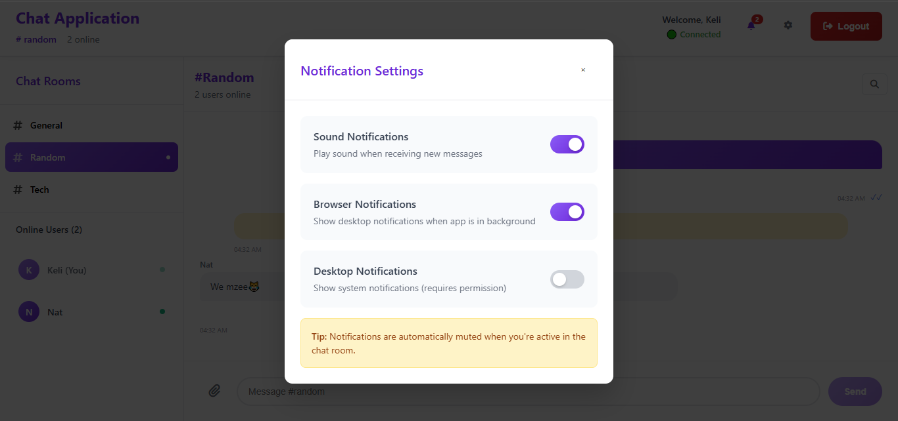
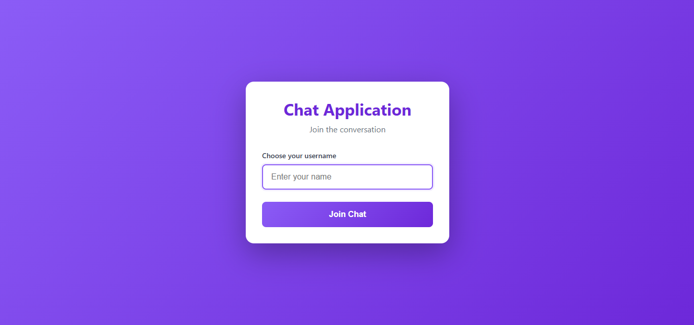

# Real Time Chat Application with Socket.io

A professional, real-time chat application built with React, Node.js, and Socket.io. Features multiple chat rooms, private messaging, file sharing, read receipts, and real time notifications.

##  Features

### Core Features
- **Real-time messaging** with Socket.io
- **Multiple chat rooms** (General, Random, Tech)
- **User authentication** with username-based login
- **Online user list** with presence indicators
- **Typing indicators**

### Advanced Features
- **Private messaging** between users
- **File sharing** with drag & drop support
- **Message reactions** (like WhatsApp)
- **Read receipts** with WhatsApp-style ticks
- **Real time notifications** with sound and browser alerts
- **Professional UI** with white/purple theme and smooth animations

### Technical Features
- **Responsive design** for desktop and mobile
- **Auto reconnection** for network issues
- **Message persistence** within rooms
- **Optimized performance** with message pagination
- **Professional icons** with Font Awesome

##  Tech Stack

### Frontend
- React 18
- Vite
- Socket.io Client
- Font Awesome Icons
- CSS3 with Animations

### Backend
- Node.js
- Express.js
- Socket.io
- CORS

##  Installation

### Prerequisites
- Node.js (v18 or higher)
- npm or yarn

### Local Development

1. **Clone the repository**
   ```bash
   git clone <your-repo-url>
   cd real-time-communication-with-socket-io
   ```
2. **Setup Backend**
  ``` bash
  cd server
  npm install
  cp .env.example .env
  npm run dev  
  ```
- Server runs on http://localhost:5000
3. **Setup Frontend**
  ```bash
   cd client
  npm install
  npm run dev
  ```
- Client runs on http://localhost:5173
4. Open multiple browser tabs and test with different usernames

## Deployment
- Backend on Render 
- Frontend to Vercel

## Usage
- Join Chat: Enter your username to join the default room
- Switch Rooms: Click on different rooms in the sidebar
- Send Messages: Type in the input and press Enter or click Send
- Private Messages: Click on any user in the online list to send private messages
- Share Files: Click the paperclip icon to upload and share files
- React to Messages: Click the smiley face to add reactions
- Notifications: Click the bell icon to view notifications

## Features in detail
**Real-time Communication**
- Instant message delivery across all connected clients
- Live typing indicators
- User join/leave notifications

**Multiple Rooms**
- Separate conversations in different rooms
- Room-specific user lists and messages
- Easy room switching

**File Sharing**
- Support for various file types
- File size validation (5MB limit)
- Download functionality for shared files

**Notifications**
- Sound alerts for new messages
- Browser notifications when app is in background
- Unread message counters

**Professional UI**
- Clean white and purple color scheme
- Smooth animations and transitions
- Responsive design for all devices
- Professional Font Awesome icons

## Demo
[View live app here](https://xochat.vercel.app)





## Socket Events
- ```user_join``` - User joins chat
- ```send_message``` - Send chat message
- ```private_message``` - Send private message
- ```send_file``` - Share file
- ```typing``` - Typing indicator
- ```message_reaction``` - Add reaction to message
- ```message_read``` - Mark message as read

## License
This project is protected under MIT License. See [License](License)

## Developed By:
Natalie Awinja @Keli281


